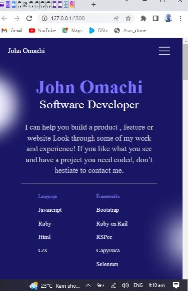

# Personal Portfolio project

> This Project is a clone of a Portfolio template from figma

## Built With

- HTML/CSS
- NPM, Git, Github

## Live Demo

[Live Demo Link](https://mromachi.github.io/Portfolio-Microverse/)

## Getting Started

**this website can be viewd better on the Mobile screen size**



**The purpose of these project is to build the Mobile interface of a portfolio website using the figma template. This project includes linters for Reporting errors in HTML, CSS and An open-source, automated tool for improving the quality of web pages, which has audits for performance, accessibility, progressive web apps, SEO and more. It is a summary of all my works**

To get a local copy up and running follow these simple example steps.

## Clone The Repositiry to your local machine by following the steps below

Step 1: Type the following command into a git shell

git clone https://github.com/MrOmachi/Portfolio-Microverse.git

Step 2: Direct a terminal into the cloned repository directory

### Prerequisites

1. Node package Manager(NPM)
   - To install NPM on your local machine, please visit [ NPM official website](https://nodejs.org/en/download/)

- Text editor(Vscode, Atom, NotePad++, Sublime)

### Setup

Set up folder as:

1. /PORTFOLIO-MICROVERSE -.github/workflows - linters.yml
   - images
     - Ellipse 18.svg
     - Ellipse 18@2x.png
     - Ellipse 18.png
     - Ellipse 18.svg
     - github.png
     - hamburger.png
     - twitter.png
     - Vector.png
     - vector2.png
     - vector3.png
     - portfolioImg.jpeg
     - ImgPlaceholder.png
   - .hintrc
   - .stylelintrc.json
   - index.html
   - LICENSE
   - Package-lock.json
   - Package.json
   - style.css

### Install

Run the following commands to install dependencies

```

npm install --save-dev hint@7.x
npm install --save-dev stylelint@13.x stylelint-scss@3.x stylelint-config-standard@21.x stylelint-csstree-validator@1.x

```

### Usage

```

npx hint .
npx stylelint "**/*.{css,scss}"

```

### Deployment

## Authors

👤 **Omachi John Sunday**

- GitHub: [@githubhandle](https://github.com/MrOmachi)
- Twitter: [@twitterhandle](https://twitter.com/Mr_Omachi)
- LinkedIn: [LinkedIn](https://www.linkedin.com/mwlite/in/john-omachi-00446210b)

## 🤝 Contributing

Contributions, issues, and feature requests are welcome!

Feel free to check the [issues page](../../issues/).

## Show your support

Give a ⭐️ if you like this project!

## 📝 License

This project is [MIT](./MIT.md) licensed.
